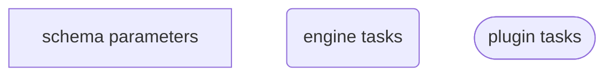
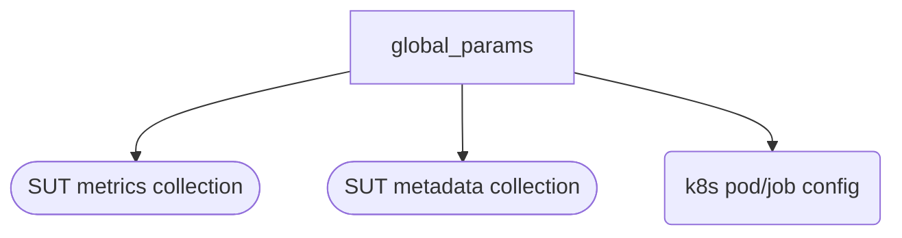
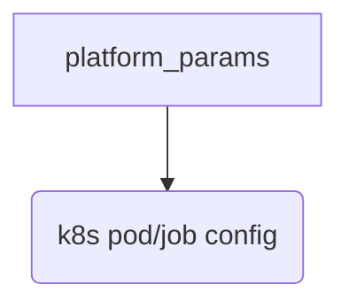
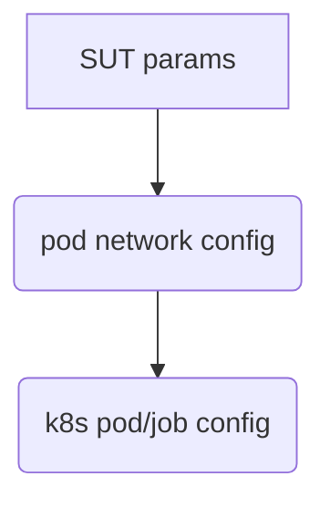
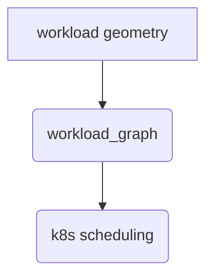

# Kube-burner Workflow

## Workflow description

This workflow describes and end-to-end benchmark for the various tests included in kube-burner, from cluster-density to networkpolicy-case3. 

A single top-level schema provides all of the data and metadata constructs required to describe the complete list of benchmark workloads to be run, as well global and SUT (system under test) parameters.
These parameters further define the environment in whic the test is run and how other parallel data collections will be handled. Finally, all data and metadata from the sequence of tests are post-processed into an appropriate document format and indexed into Elasticsearch

## Diagram Key


## Workflow and schema breakdown

Global parameters define metadata items that will persist through the entire workflow, as well as flags for whether specific workload features, and therefore plugins, will be used.

```yaml
global_params:
    platform: enum
  	kubeconfig: str
  	es_server: str
    es_index: str
  	metadata_collection: bool
  	metadata_targeted: bool
  	system_metrics_collection: bool
  	uuid: str
   	cluster_name: str
    prom_url: str
  	prom_token: str
    job_timeout: int
    qps: int
    burst: int
    step_size: int
    preload_images: bool
    preload_period: int
    cleanup: bool
    cleanup_when_finish: bool
    cleanup_timeout: int
    log_level: str
    pprof_collection: bool
    pprof_collection_interval: int
    hypershift: bool
    mgmt_cluster_name: str
    hosted_cluster_ns: str
    thanos_receiver_url: str
    platform_alerts: bool
```



Platform params provide platform-specific authentication and resource values:

```yaml
platform_params:
  	auth_key1: str
  	auth_key2: str
  	resource_key1: str
  	resource_key2: str
```



SUT parameters affect kubernetes settings for pods and potentially other objects.
```yaml
sut_params:
    node_selector: str
    pod_node_selector: str
    pod_wait: bool
    max_wait_timeout: int
    wait_for: list[str]
    verify_objects: bool
    error_on_verify: bool
    pod_ready_threshold: int
    kubeburner_image: str
```



The parameters for the kubeburner workloads should be available as defaults that will apply until overridden.

```yaml
kubeburner_workloads:
    defaults:
        workload: cluster-density
            job_iterations: int
        workload: node-density
            node_count: int
            pods_per_node: int
        workload: node-density-heavy
            node_count: int
            pods_per_node: int
        workload: node-density-cni
            node_count: int
            pods_per_node: int
        workload: node-density-cni-policy
            node_count: int
            pods_per_node: int
        workload: pods-service-route
            node_count: int
            pods_per_node: int
        workload: max-namespaces
            namespace_count: int
        workload: max-services
            service_count: int
        workload: pod-density
            pods: int
        workload: pod-density-heavy
            pods: int
        workload: custom
            workload_template: str
            metrics_profile: str
            alerts_profile: str
```

Individual workloads should be provided as lists of dicts, where parameters override the `defaults` above. Each list item should accept all parameteres supported by the underlying schema. 

```yaml
kubeburner_workloads:
        workload: list[dict]
        - dict
        - dict
        ...
```



## Complete workflow schema and diagram

```yaml
global_params:
    platform: enum
  	kubeconfig: str
  	es_server: str
    es_index: str
  	metadata_collection: bool
  	metadata_targeted: bool
  	system_metrics_collection: bool
  	uuid: str
   	cluster_name: str
    prom_url: str
  	prom_token: str
    job_timeout: int
    qps: int
    burst: int
    step_size: int
    preload_images: bool
    preload_period: int
    cleanup: bool
    cleanup_when_finish: bool
    cleanup_timeout: int
    log_level: str
    pprof_collection: bool
    pprof_collection_interval: int
    hypershift: bool
    mgmt_cluster_name: str
    hosted_cluster_ns: str
    thanos_receiver_url: str
    platform_alerts: bool

    sut_params:
    node_selector: str
    pod_node_selector: str
    pod_wait: bool
    max_wait_timeout: int
    wait_for: list[str]
    verify_objects: bool
    error_on_verify: bool
    pod_ready_threshold: int
    kubeburner_image: str

    kubeburner_workloads:
    defaults:
        workload: cluster-density
            job_iterations: int
        workload: node-density
            node_count: int
            pods_per_node: int
        workload: node-density-heavy
            node_count: int
            pods_per_node: int
        workload: node-density-cni
            node_count: int
            pods_per_node: int
        workload: node-density-cni-policy
            node_count: int
            pods_per_node: int
        workload: pods-service-route
            node_count: int
            pods_per_node: int
        workload: max-namespaces
            namespace_count: int
        workload: max-services
            service_count: int
        workload: pod-density
            pods: int
        workload: pod-density-heavy
            pods: int
        workload: custom
            workload_template: str
            metrics_profile: str
            alerts_profile: str

    kubeburner_workloads:
        workload: list[dict]
        - dict
        - dict
        ...
```