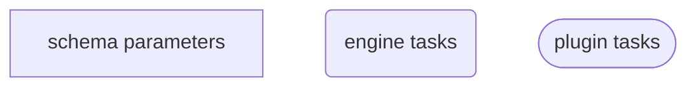
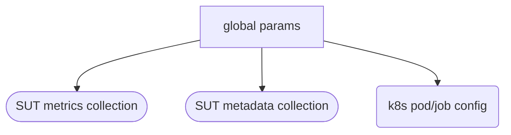
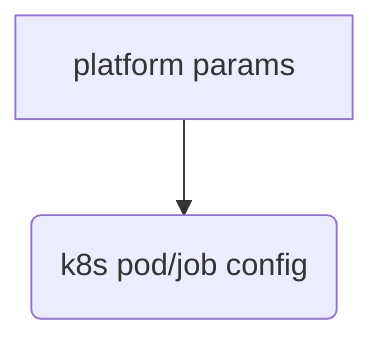
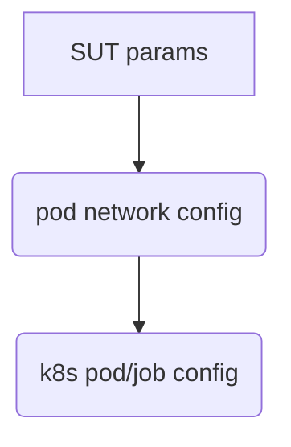
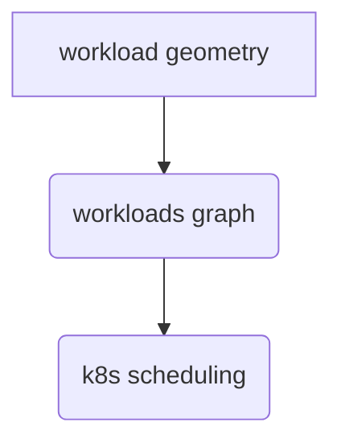
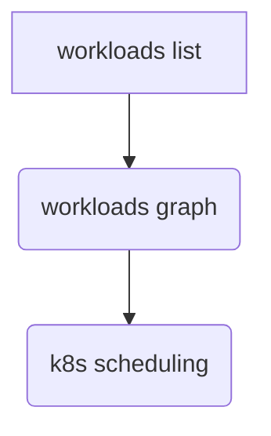
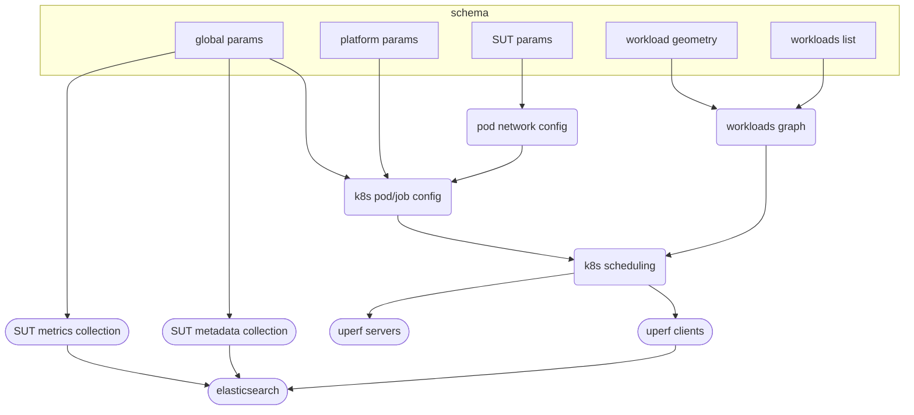

# Network Performance Workflow

## Workflow description

This workflow defines and end-to-end benchmark test for network performance, specifically using the [uperf](https://github.com/uperf/uperf) benchmark utility. This is targeted at Kubernetes environments and includes orchestration of necessary objects via the k8s APIs.

A single top-level schema provides all of the data and metadata constructs required to describe the complete list of benchmark workloads to be run, as well global and SUT (system under test) parameters that further define the environment within which the test is run and how other parallel data collections will be handled. Finally, all data and metadata from the sequence of tests are post-processed into an approproate document format and indexed into Elasticsearch.

## Diagram Key


## Workflow and schema breakdown
Global parameters define metadata items that will persist through the entire workflow, as well as flags for whether specific workflow features, and therefore plugins, will be used.

```yaml
global_params:
    platform: enum
    kubeconfig: str
    es_server: str
    metadata_collection: bool
    metadata_targeted: bool
    system_metrics_collection: bool
    uuid: str
    cluster_name: str
    prom_token: str
```


Platform params provide platform-specific auth and resource values.
```yaml
# TODO: Flesh out what's needed per-platform
platform_params:
    auth_key1: str
    auth_key2: str
    resource_key1: str
    resource_key2: str
```


SUT parameters affect k8s settings for pods and potentially other objects.
```yaml
sut_params:
    network_policy: bool
    multi_az: bool
    hostnetwork: bool
    serviceip: bool
    test_timeout: int
    run_id: str
    servicetype: str
    metallb:
        addresspool: str
        service_etp: str
    multus:
        enabled: bool
```


The workload geometry params will define the distribution of client and server uperf pods.
```yaml
# TODO: Determine how to describe client/server distribution
workload_geometry:
    key1:
    key2:
```


The parameters for the uperf workloads should be available as defaults that will apply to all listed workloads unless overridden.
```yaml
uperf_workloads:
    defaults:
        samples: int
        pairs: list[int]
        nthrs: list[int]
        protos:  list[enum]
        test_types:  list[enum]
        sizes:  list[int]
        runtime: int
```

Individual workloads should be provided as lists of dicts, where parameters override the `defaults` above. Each list item should accept all parameters supported by the underlying uperf schema.
```yaml
uperf_workloads:
    workload: list[dict]
        - dict
        - dict
        - ...
```


## Complete workflow schema and diagram
```yaml
global_params:
    platform: enum
    kubeconfig: str
    es_server: str
    metadata_collection: bool
    metadata_targeted: bool
    system_metrics_collection: bool
    uuid: str
    cluster_name: str
    prom_token: str

# TODO: Flesh out what's needed per-platform
platform_params:
    auth_key1: str
    auth_key2: str
    resource_key1: str
    resource_key2: str

sut_params:
    network_policy: bool
    multi_az: bool
    hostnetwork: bool
    serviceip: bool
    test_timeout: int
    run_id: str
    servicetype: str
    metallb:
        addresspool: str
        service_etp: str
    multus:
        enabled: bool

# TODO: Determine how to describe client/server distribution
workload_geometry:
    key1:
    key2:

uperf_workloads:
    defaults:
        samples: int
        pairs: list[int]
        nthrs: list[int]
        protos:  list[enum]
        test_types:  list[enum]
        sizes:  list[int]
        runtime: int
    workload: list[dict]
        - dict
        - dict
        - ...
```

